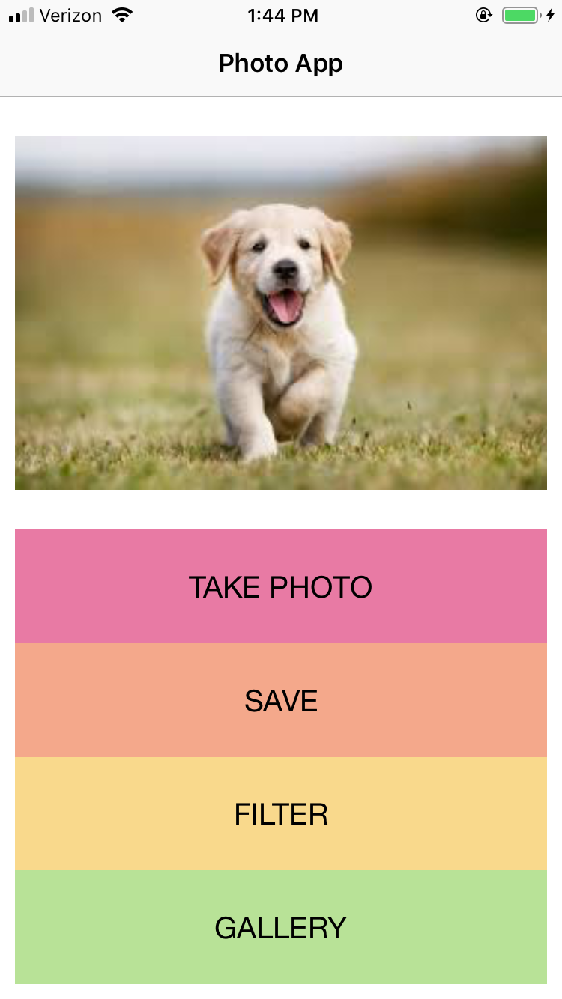
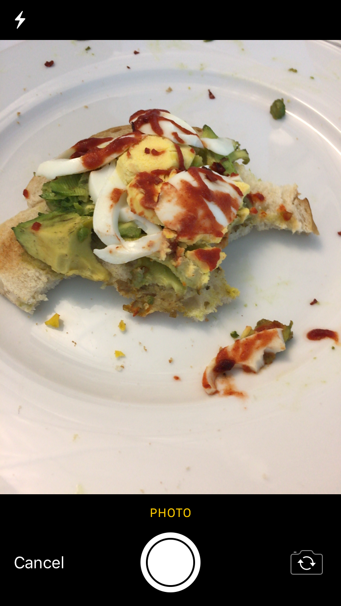
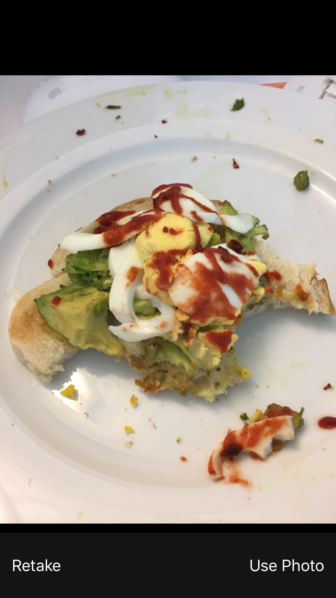
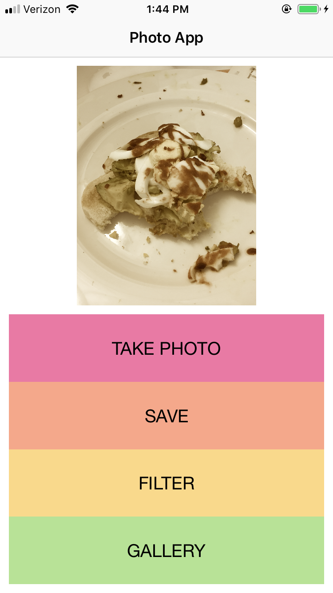
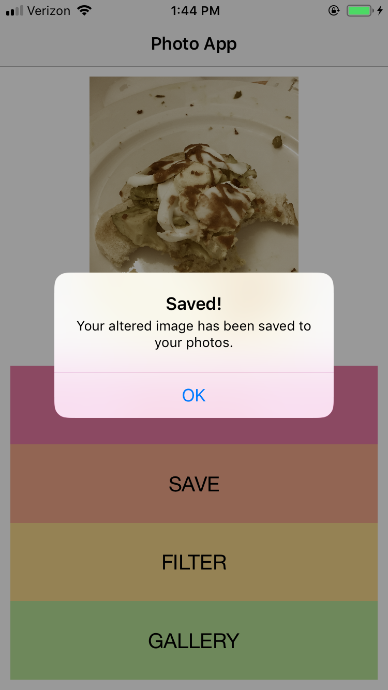
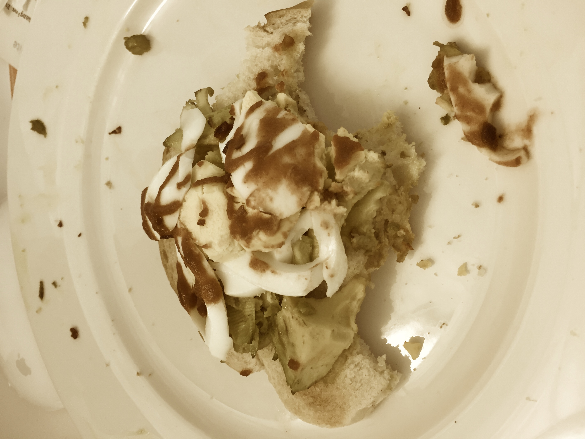
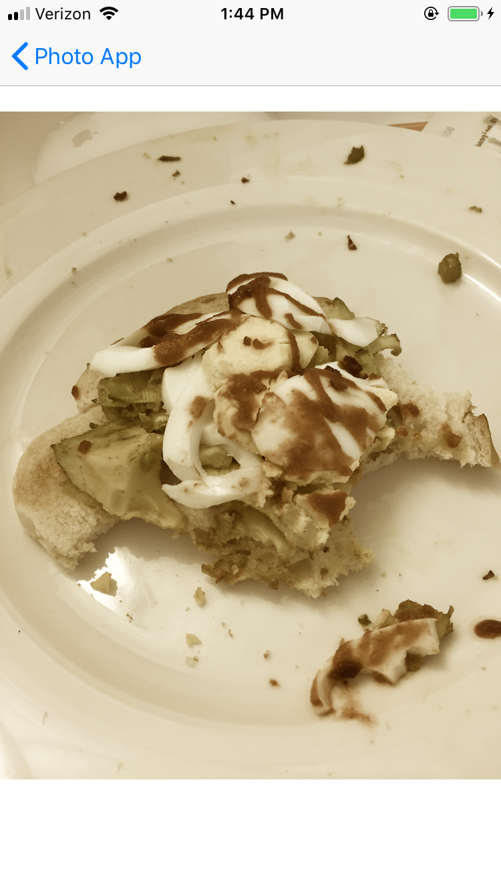

# PhotoApp

A programatically built photo app that takes pictures, filters, saves to the phone's photo gallery and has it's own gallery.

Main Screen to take photos, filter, save, and go to gallery:
 

Take photos:
 

Use the photo or retake the photo:
 

Filter the photo:
 

Press Save on Photo:
 

Photo on Camera Roll:
 

In App Gallery:
 
